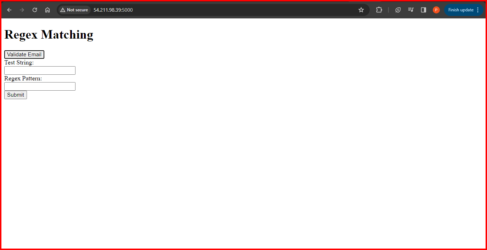

# Regex_matching_app and email validation tool:

This project is a Regex Tester and Email Validator web application developed using Flask. It allows users to test regular expressions and validate email addresses. The application provides a simple and intuitive interface for users to input text and patterns, with real-time validation results displayed on the page. With its lightweight design and powerful functionality, it's a valuable tool for developers and users working with regular expressions and email validation.

# Key Features:

Test regular expressions against input text Validate email addresses instantly User-friendly interface with real-time results Built with Flask for simplicity and flexibility

# Installation:

Clone the repository to your local machine. Install the required dependencies using pip install -r requirements.txt. Run the application using python app.py. Access the application in your web browser at http://localhost:5000.

# Contributing:

Contributions are welcome! Feel free to submit bug reports, feature requests, or pull requests to help improve this project.
