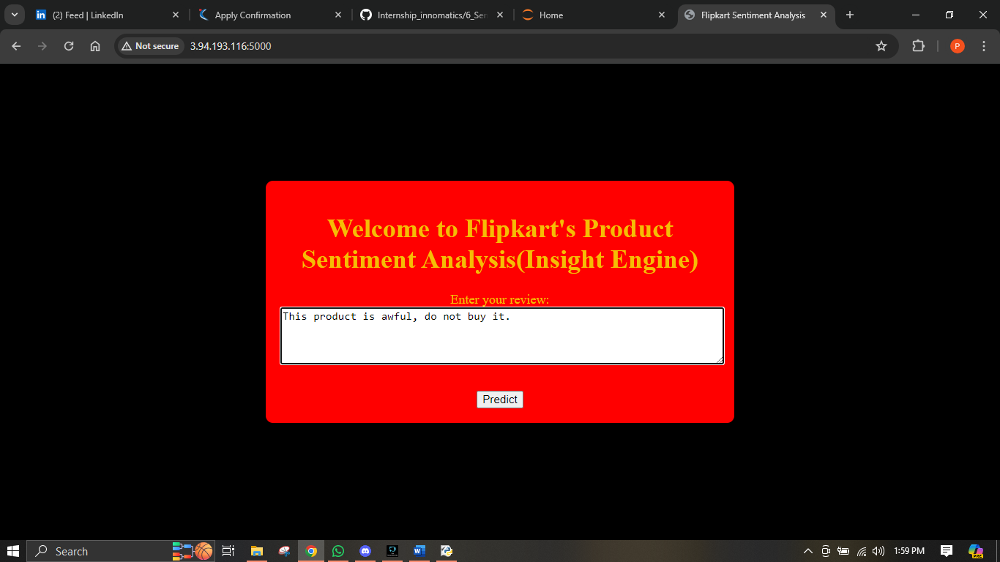
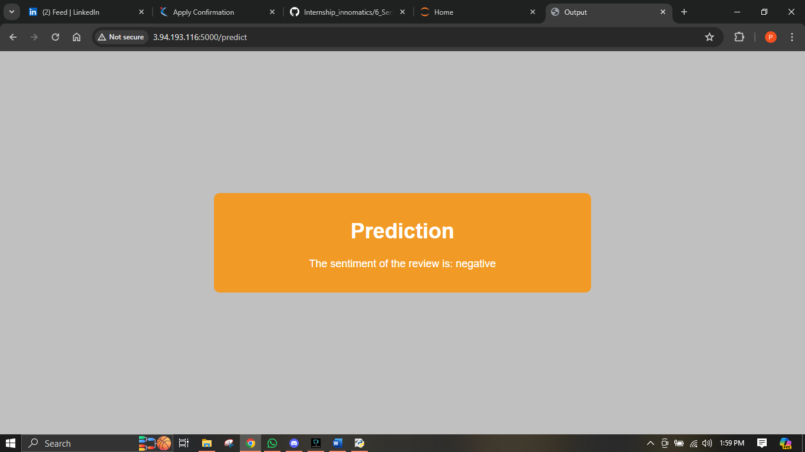

# Objective

The objective of this project is to classify customer reviews as positive or negative and understand the pain points of customers who write negative reviews. By analyzing the sentiment of reviews, we aim to gain insights into product features that contribute to customer satisfaction or dissatisfaction.

# Data Preprocessing

1. Text Cleaning: Remove special characters, punctuation, and stopwords from the review text.
2. Text Normalization: Perform lemmatization or stemming to reduce words to their base forms.
3. Numerical Feature Extraction: Apply techniques like Bag-of-Words (BoW), Term Frequency-Inverse Document Frequency (TF-IDF), Word2Vec (W2V), and BERT models for feature extraction.

# Modeling Approach

1. Model Selection: Train and evaluate various machine learning and deep learning models using the embedded text data.
2. Evaluation Metric: Use the F1-Score as the evaluation metric to assess the performance of the models in classifying sentiment.

# Model Deployment

1. Flask or Streamlit App Development: Develop a Flask or Streamlit web application that takes user input in the form of a review and generates the sentiment (positive or negative) of the review.
2. Model Integration: Integrate the trained sentiment classification model into the Flask or Streamlit app for real-time inference.
3. Deployment: Deploy the Flask or Streamlit app on an AWS EC2 instance to make it accessible over the internet.

# Workflow

1. Data Loading and Analysis: Gain insights into product features that contribute to customer satisfaction or dissatisfaction.
2. Data Cleaning: Preprocess the review text by removing noise and normalizing the text.
3. Text Embedding: Experiment with different text embedding techniques to represent the review text as numerical vectors.
4. Model Training: Train machine learning and deep learning models on the embedded text data to classify sentiment.
5. Model Evaluation: Evaluate the performance of the trained models using the F1-Score metric.
6. Flask or Streamlit App Development: Develop a Flask or Streamlit web application for sentiment analysis of user-provided reviews.
7. Model Deployment: Deploy the trained sentiment classification model along with the Flask or Streamlit app on an AWS EC2 instance.
8. Testing and Monitoring: Test the deployed application and monitor its performance for any issues or errors.
